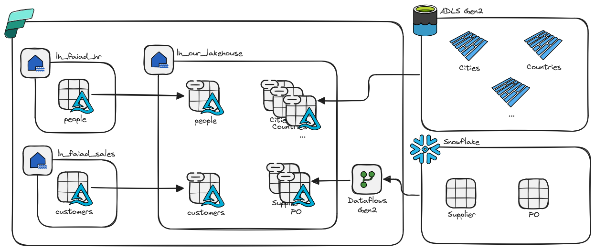
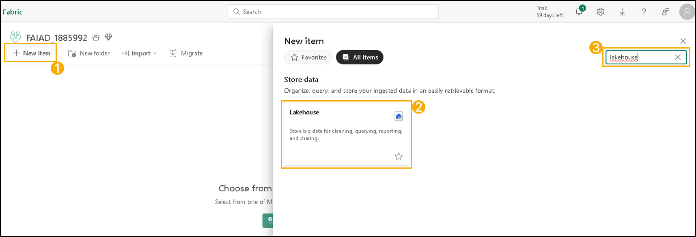
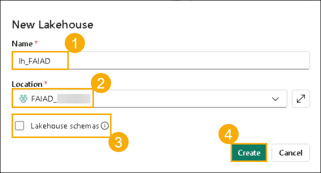
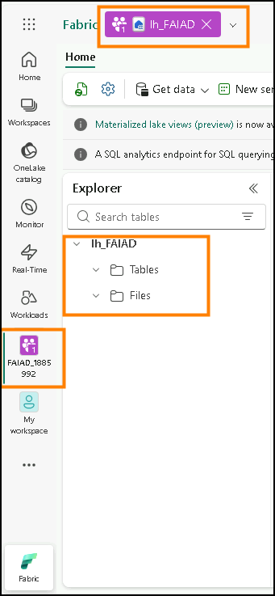

# The goal
Our goal for this lab is to establish connections to three different data sources and to bring everything together in Fabric.

# Create a Lakehouse

1. In your workspace, locate the + New item (__1__) button on the left-hand navigation pane. This is where you can begin creating new items in your workspace.

2. In the search box, type Lakehouse (__2__) and, from the search results, select the Lakehouse (__3__) option. This will enable you to create a new Lakehouse to store, query, and manage your big data.

3. A new lakehouse dialog will appear. Enter lh_FAIAD (1) in the Name textbox.

<b>Note: </b>
<ul>
<li>Please make sure to deselect the Lakehouse Schema feature, as it is now enabled by default.</li>
<li>lh here refers to Lakehouse. We are prefixing lh so that it is easy to identify and search.</li>
<li>The preview feature of <b>Lakehouse Schemas</b> is very interesting so it is something you should be aware of. Since it is in <b>Preview</b> state, we will ignore it so there is no negative impact on the lab experience. Once the feature is general available we will bring it into this lab.</li>

4. Choose your workspace (2) as the location.

5. Make sure Lakehouse schemas (3) is unchecked.

6. Then, select Create (4) to proceed.

<b>Note: </b>Please make sure to deselect the Lakehouse Schema feature, as it is now enabled by default.

Within a few moments, a Lakehouse is created, and you will be navigated to the Lakehouse explorer interface. On the top left, next to the Fabric name in the header, you will have the Lakehouse icon. The workspace icon on the left navigation will reflect that it now contains an item

Within the Lakehouse Explorer, you will notice a Tables and Files section. A Lakehouse could expose Azure Data Lake Storage Gen2 files under the files section, or a dataflow could load data to Lakehouse tables. There are various options available. We are going to show you some of the options in the following labs.

