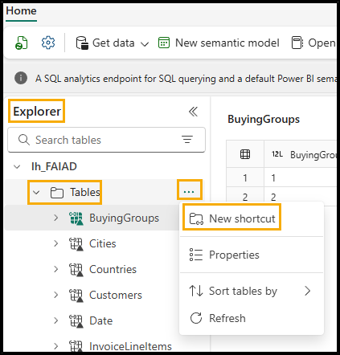
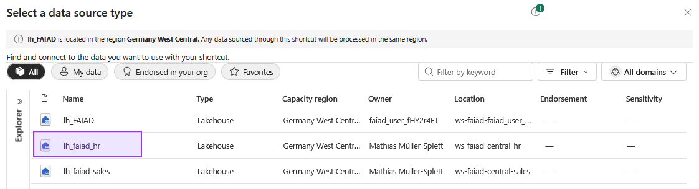
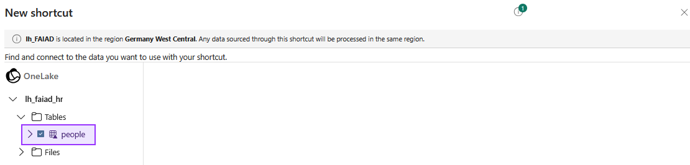
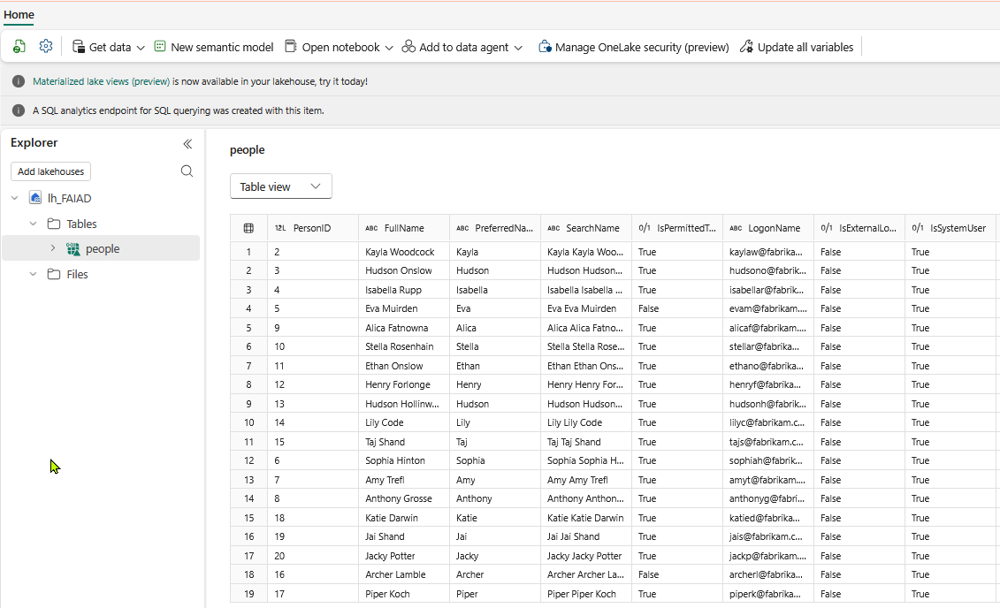
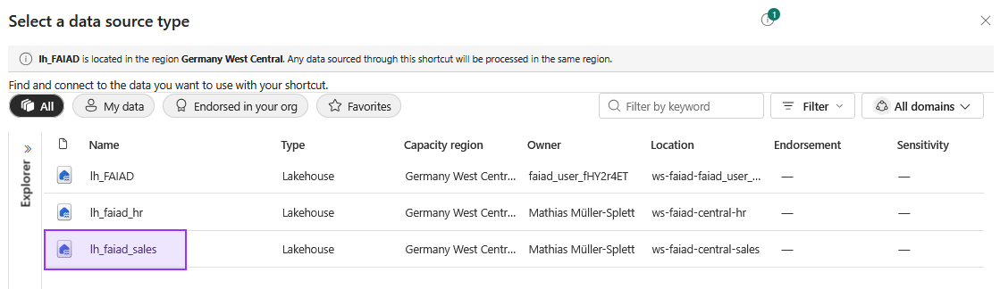
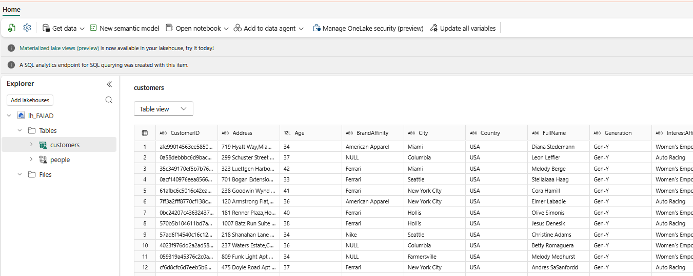

# The goal
Establish shortcuts to our tables `people` and `customer`.

## What are shortcuts?
Shortcuts are a way to point to delta parquet tables stored somewhere else, without copying the actual data.

We got support for S3 buckets, Google BigQuery, ADLS and OneLake.

# Add `people` table from OneLake

1. Open your lakehouse in your workspace.

2. In Explorer panel, select the ellipsis next to Tables.

3. Select New Shortcut.

4. New shortcut dialog opens. Select Microsoft OneLake option under Internal sources.

5. Select __lh_faiad_hr__.

6. Select __Next__.

7. In the left panel, expand __lh_faiad_hr -> Tables__. Notice the IT admin has provided access to `people` table.

8. Select `people`.

9. Select __Next__.

10. Select __Create__ on the next dialog. You will be navigated back to lh_FAIAD lakehouse.

11. In the Explorer panel on the left, notice the new `people` table has been created.

12. Select `people` table to view the data in the preview panel.

# Add `customers` table from OneLake

1. In Explorer panel, select the ellipsis next to Tables.

2. Select New Shortcut.

3. New shortcut dialog opens. Select Microsoft OneLake option under Internal sources.

4. Select __lh_faiad_sales__.

5. Select __Next__.

6. In the left panel, expand __lh_faiad_hr -> Tables__. Notice the IT admin has provided access to `customers` table.

7. Select `customers`.

8. Select __Next__.

9. Select __Create__ on the next dialog. You will be navigated back to lh_FAIAD lakehouse.

10. In the Explorer panel on the left, notice the new `customers` table has been created.

11. Select `customers` table to view the data in the preview panel.
