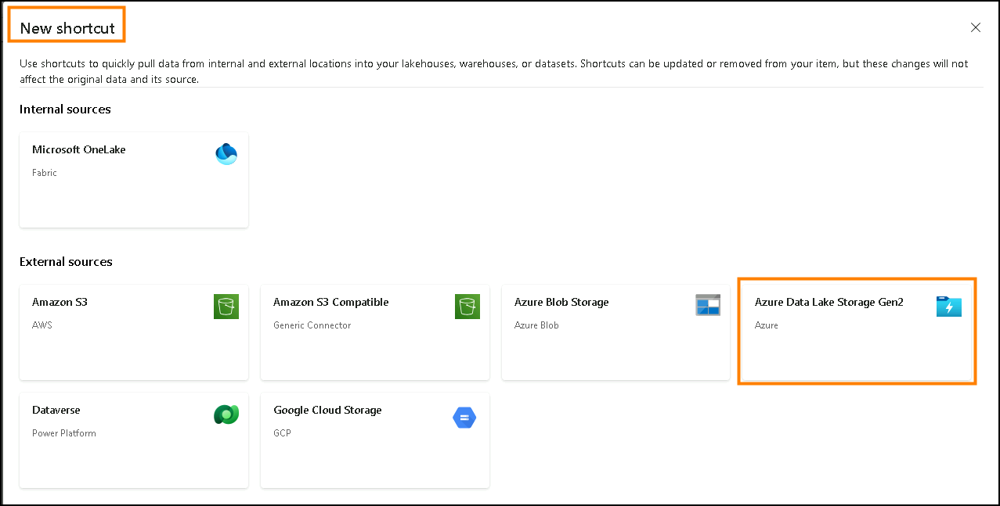
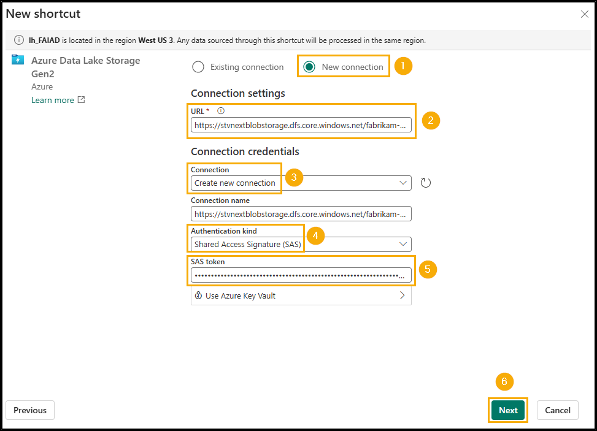
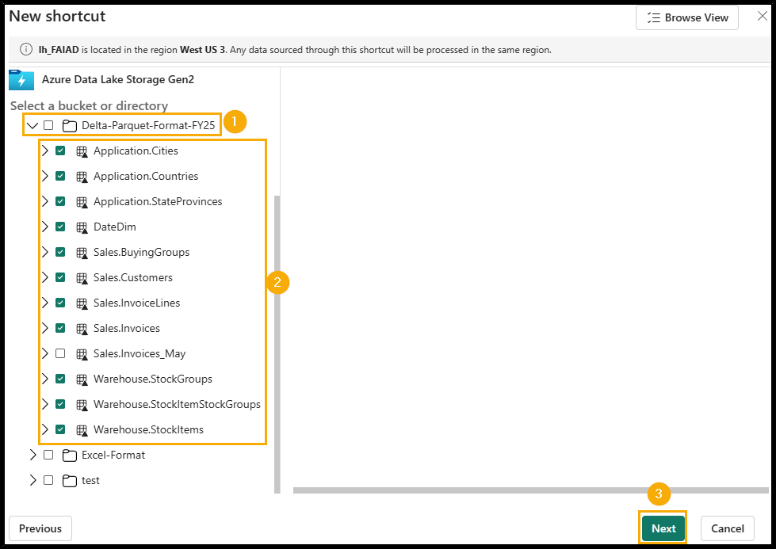
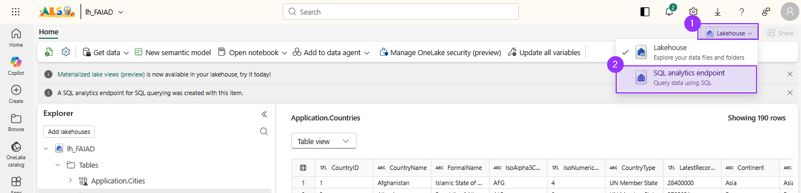
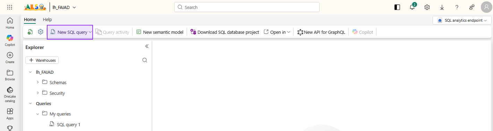

# The goal
Create shortcuts to the raw tables from our ERP system and establish some business logic on top of them to transform the data into a structure we can utilize.

# Add all needed tables from ADLS Gen2 to our lakehouse

1. In Explorer panel, select the ellipsis next to Tables.

2. Select New Shortcut.


3. New Shortcut dialog opens. Under External sources, select Azure Data Lake Storage Gen2.


4. Select New connection (1).

5. Enter the following link for the URL property: `https://stvnextblobstorage.dfs.core.windows.net/fabrikam-sales` (2):

6. Click on Create New Connection (3) under the Connection section

7. Select Shared Access Signature (SAS) (4) from the Authentication kind dropdown.

8. Copy the SAS token and paste it into the SAS token (5) field.

   - SAS-Token: `?sv=2023-01-03&ss=btqf&srt=sco&st=2025-06-30T10%3A15%3A46Z&se=2026-06-30T10%3A15%3A00Z&sp=rl&sig=hVeyxY4F72YVH3X%2BlnIvVTg8M%2FwZgLIhDzBgHlv1580%3D`


9. Select the following tables:
  
   - Application.Cities

   - Application.Countries

   - Application.StateProvinces

   - DateDim

   - Sales.BuyingGroups

   - Sales.Customers

   - Sales.InvoiceLines

   - Sales.Invoices

   - Warehouse.StockGroups

   - Warehouse.StockItemStockGroups

   - Warehouse.StockItems

<div style="border-left: 3px solid #FFA500; background-color: #FFF8E1; padding: 3px; border-radius: 4px; color: #000;">
<b>Note: </b> Sales.Invoices_May is the only directory that is <u>not selected</u>.
</div>



# Create views to shape our operational data

Next we take the data that we succesfully landed in our lakehouse and transform it using views.

For this we need to switch to the SQL analytics endpoint of our lakehouse. Click on `Lakehouse` (1) and choose `SQL analytics endpoint` (2).


## Create `Geo` view
The view geo will combine the tables 
- `Application.Cities`
- `Application.Countries`
- `Application.StateProvinces`

Click on __New SQL query__ to open up a new query.


``` sql
CREATE OR ALTER VIEW [dbo].[Geo] AS
SELECT 
    c.[CityID],
    c.[CityName],
    c.[LatestRecordedPopulation],
    sp.[StateProvinceCode],
    sp.[StateProvinceName],
    sp.[SalesTerritory],
    co.[CountryName],
    co.[FormalName],
    co.[IsoAlpha3Code],
    co.[IsoNumericCode],
    co.[CountryType],
    co.[Continent],
    co.[Region],
    co.[Subregion]
FROM [lh_FAIAD].[dbo].[Application.Cities] AS c
INNER JOIN [lh_FAIAD].[dbo].[Application.StateProvinces] AS sp 
    ON c.[StateProvinceID] = sp.[StateProvinceID] 
    OR (c.[StateProvinceID] IS NULL AND sp.[StateProvinceID] IS NULL)
INNER JOIN [lh_FAIAD].[dbo].[Application.Countries] AS co 
    ON sp.[CountryID] = co.[CountryID] 
    OR (sp.[CountryID] IS NULL AND co.[CountryID] IS NULL)
GO
```

## Create `Reseller` view
The view geo will combine the tables 
- `Sales.BuyingGroups`
- `Sales.Customers`

Click on __New SQL query__ to open up a new query.


``` sql
CREATE OR ALTER VIEW [dbo].[Reseller] AS
SELECT 
    c.[ResellerID],
    c.[ResellerName],
    c.[PostalCityID],
    c.[PhoneNumber],
    c.[FaxNumber],
    c.[WebsiteURL],
    c.[DeliveryAddressLine1],
    c.[DeliveryAddressLine2],
    c.[DeliveryPostalCode],
    c.[PostalAddressLine1],
    c.[PostalAddressLine2],
    c.[PostalPostalCode],
    bg.[BuyingGroupName] AS [ResellerCompany]
FROM [lh_FAIAD].[dbo].[Sales.Customers] AS c
INNER JOIN [lh_FAIAD].[dbo].[Sales.BuyingGroups] AS bg
    ON c.[BuyingGroupID] = bg.[BuyingGroupID]
    OR (c.[BuyingGroupID] IS NULL AND bg.[BuyingGroupID] IS NULL)
GO
```

## Create `Sales` view
The view geo will combine the tables 
- `Sales.InvoiceLines`
- `Sales.Invoices`

and our new view `Reseller`

Click on __New SQL query__ to open up a new query.


``` sql
CREATE OR ALTER VIEW [dbo].[Sales] AS
SELECT 
    il.[InvoiceLineID],
    il.[InvoiceID],
    il.[StockItemID],
    il.[Quantity],
    il.[UnitPrice],
    il.[TaxRate],
    il.[TaxAmount],
    il.[LineProfit],
    il.[ExtendedPrice],
    i.[CustomerID] AS [ResellerID],
    i.[SalespersonPersonID],
    i.[InvoiceDate],
    il.[ExtendedPrice] - il.[TaxAmount] AS [Sales Amount]
FROM [lh_FAIAD].[dbo].[Sales.InvoiceLines] AS il
INNER JOIN [lh_FAIAD].[dbo].[Sales.Invoices] AS i
    ON il.[InvoiceID] = i.[InvoiceID]
    OR (il.[InvoiceID] IS NULL AND i.[InvoiceID] IS NULL)
WHERE EXISTS (
    SELECT 1
    FROM [lh_FAIAD].[dbo].[Reseller] AS r
    WHERE i.[CustomerID] = r.[ResellerID]
       OR (i.[CustomerID] IS NULL AND r.[ResellerID] IS NULL)
)
GO
```

## Create `Product` view
The view geo will combine the tables 
- `Warehouse.StockGroups`
- `Warehouse.StockItems`
- `Warehouse.StockItemStockGroups`

Click on __New SQL query__ to open up a new query.


``` sql
CREATE OR ALTER VIEW [dbo].[Product] AS
SELECT 
    si.[StockItemID],
    si.[StockItemName],
    si.[SupplierID],
    si.[Size],
    si.[IsChillerStock],
    si.[TaxRate],
    si.[UnitPrice],
    si.[RecommendedRetailPrice],
    si.[TypicalWeightPerUnit],
    sg.[StockGroupName]
FROM [lh_FAIAD].[dbo].[Warehouse.StockItems] AS si
LEFT OUTER JOIN [lh_FAIAD].[dbo].[Warehouse.StockItemStockGroups] AS sisg
    ON si.[StockItemID] = sisg.[StockItemID]
    OR (si.[StockItemID] IS NULL AND sisg.[StockItemID] IS NULL)
LEFT OUTER JOIN [lh_FAIAD].[dbo].[Warehouse.StockGroups] AS sg
    ON sisg.[StockGroupID] = sg.[StockGroupID]
    OR (sisg.[StockGroupID] IS NULL AND sg.[StockGroupID] IS NULL)
GO
```