# The goal
In snowflake we have stored order data, that we also need for our semantic model.
To achieve the integration we will use a pipeline to copy the needed tables to our lakehouse and utilize views on top of these to shape the data.

# Create a pipeline to copy the snowflake data

1. In your workspace, click on __New Item__ (1), type __pip__ in the searchbox (2) and select the __Pipeline__ (3).
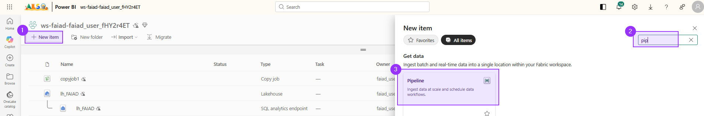

2. Give it `pl_snowflake` as the name.

3. In the pipeline click on __Copy data__ (1) and choose __Use copy assistant__ (2).
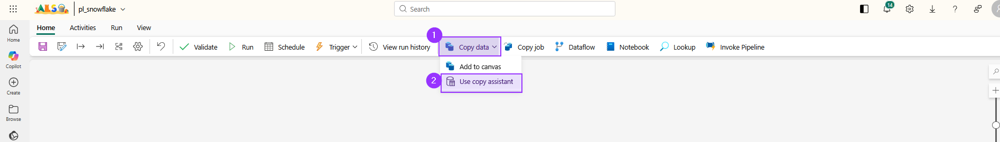

4. On the homescreen under __OneLake catalog__ you should already see a shared connection called __FAIAD Snowflake__. Click on it.
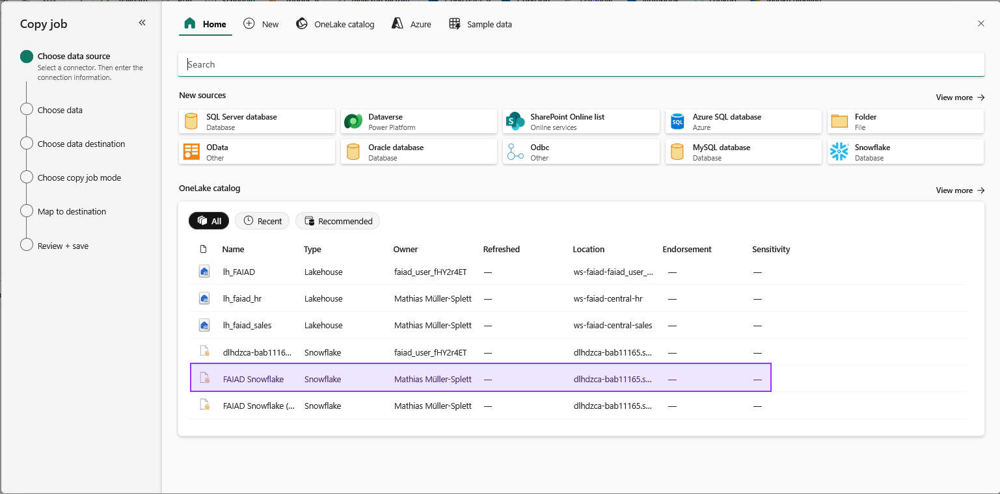

5. After a few seconds you should see a list of databases. Choose __FABRIKAM_SUPPLIERS__ and click on __Next__.
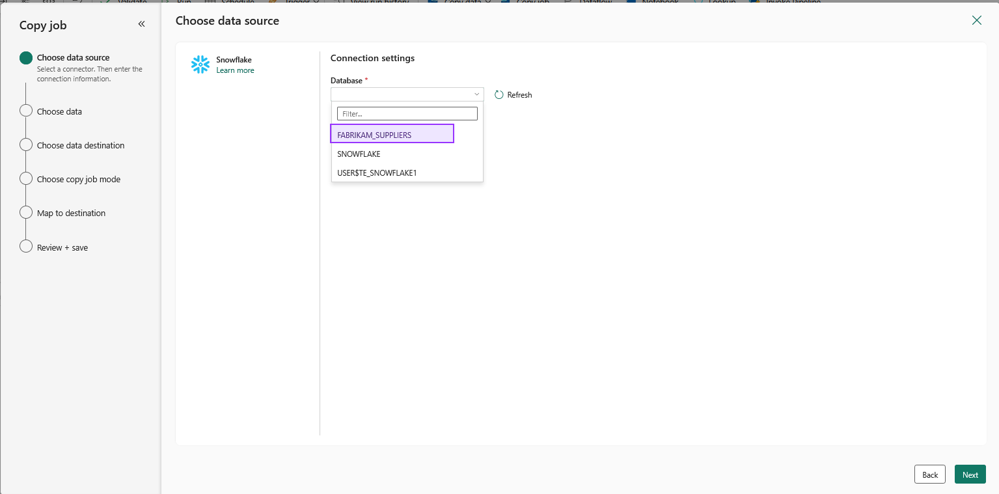

6. In the table selection scroll all the way down and select the following four tables and click __Next__:
   - `PUBLIC.ORDERLINES`
   - `PUBLIC.ORDERS`
   - `PUBLIC.SUPPLIER_CATEGORIES`
   - `PUBLIC.SUPPLIERS`
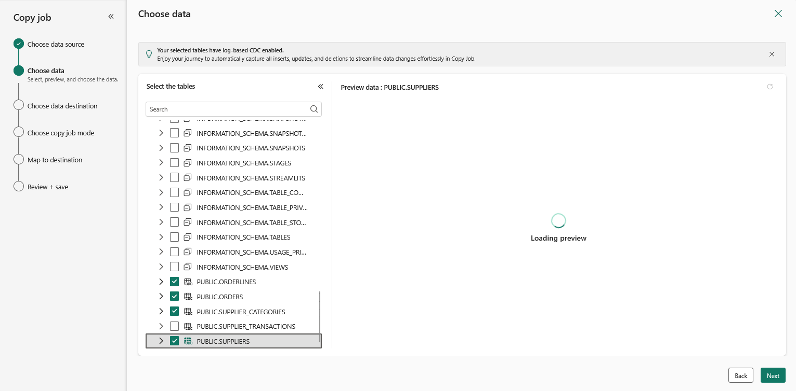

7. As the destination choose your lakehouse __lh_FAIAD__.
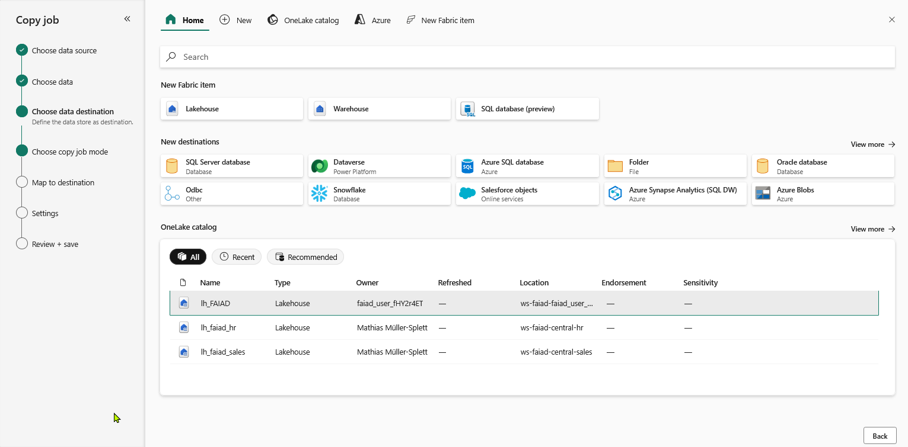

8. Make sure the __Full copy__ mode is choosen and click __Next__.
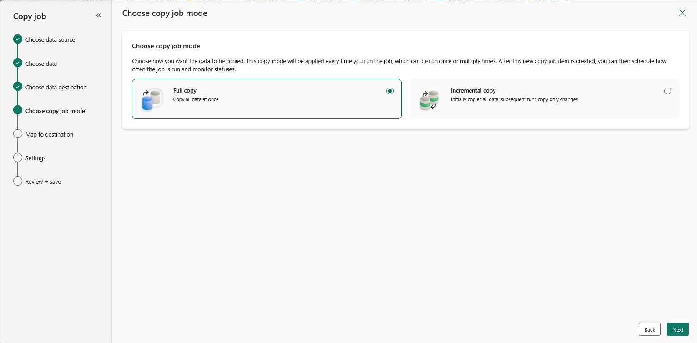

9. We need to __Edit update method__ and 
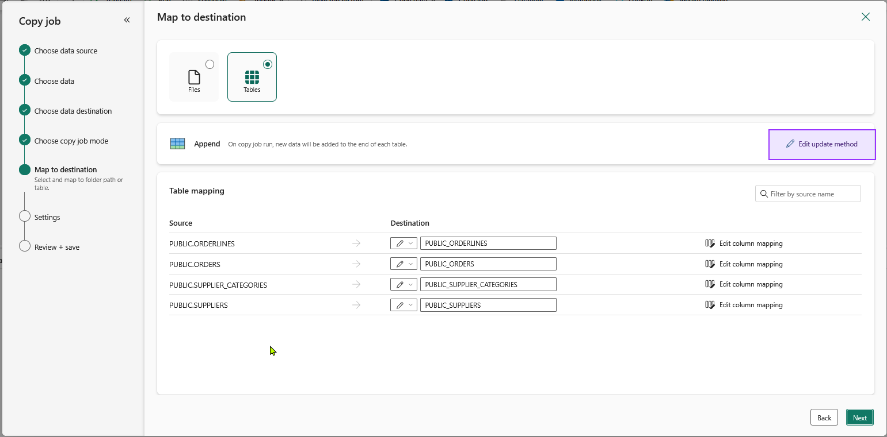

10. set it to Overwrite.
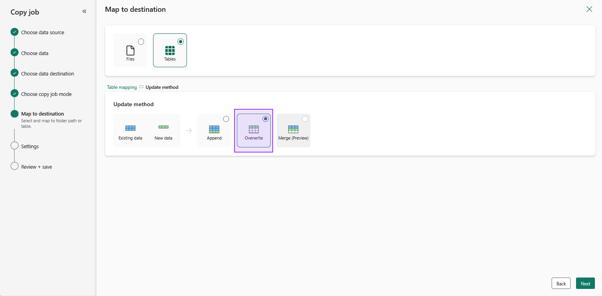

11. The Snowflake storage integration can be ignored, so click __Next__ and __Save__. 

12. In the Background a copyjopb will be created and open up for us. As soon as we are in the Copyjob click on __Run__.
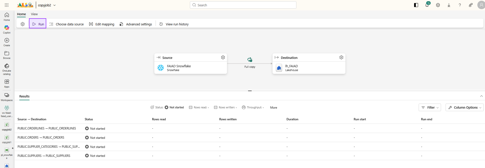

This will start the copy process of our snowflake data into our Fabric lakehouse, so we can move on to create our views.

# Create `Supplier` view
Switch back to the __SQL analytics endpoint__ of your lakehouse. With a bit of luck, you can already see the four new tables coming in from Snowflake (1). Click on __New SQL Query__ (2) so we can create our `Supplier` view.
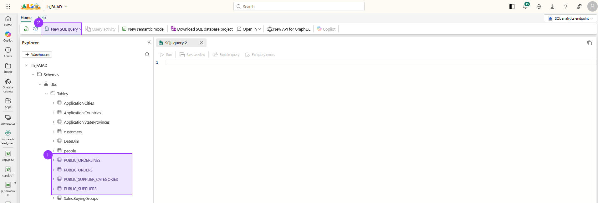

``` sql
CREATE OR ALTER VIEW Supplier AS
SELECT 
    s.SupplierID,
    s. SupplierName,
    s. SupplierCategoryID,
    s.WebsiteURL,
    sc.SupplierCategoryName
FROM 
    PUBLIC_SUPPLIERS s
LEFT OUTER JOIN 
    PUBLIC_SUPPLIER_CATEGORIES sc ON s.SupplierCategoryID = sc.SupplierCategoryID;
```

# Create `PO` view
As the last step we will create the `PO` view.

Click on __New SQL query__ to open up a new query.


``` sql
CREATE OR ALTER VIEW PO AS
SELECT 
    o.PurchaseOrderID,
    o.OrderDate,
    o.ContactPersonID,
    o.ExpectedDeliveryDate,
    pol.PurchaseOrderLineID,
    pol. StockItemID,
    pol.OrderedOuters,
    pol.ExpectedUnitPricePerOuter
FROM 
    PUBLIC_ORDERS o
INNER JOIN 
    PUBLIC_ORDERLINES pol ON o. PurchaseOrderID = pol.PurchaseOrderID;
```