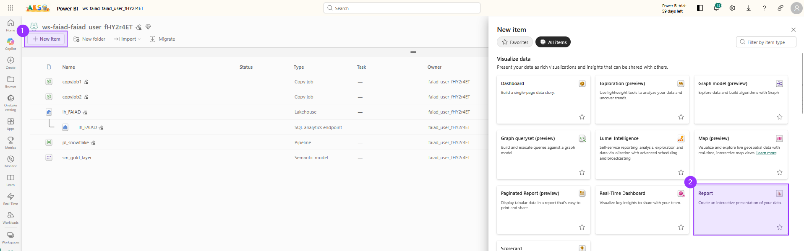
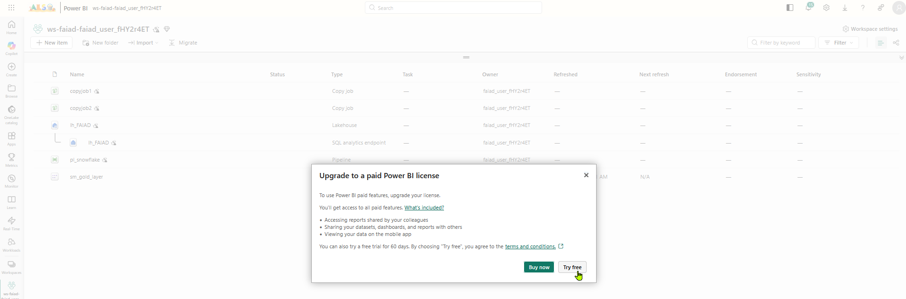
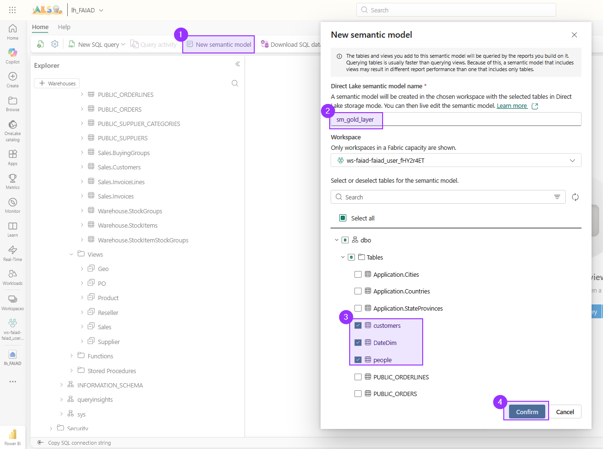
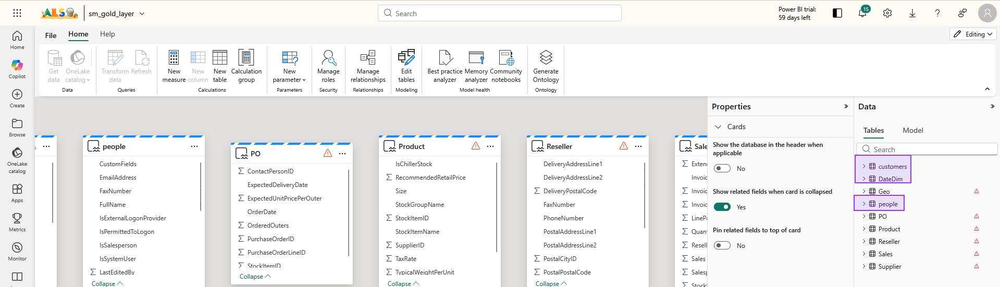
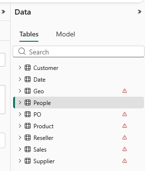
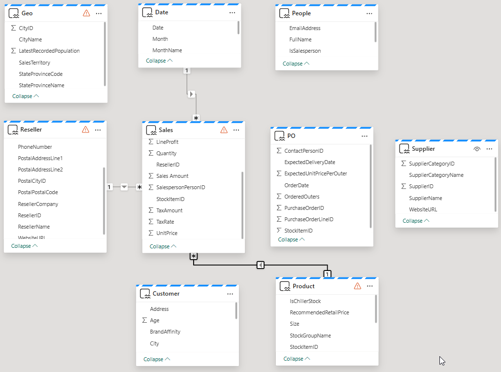
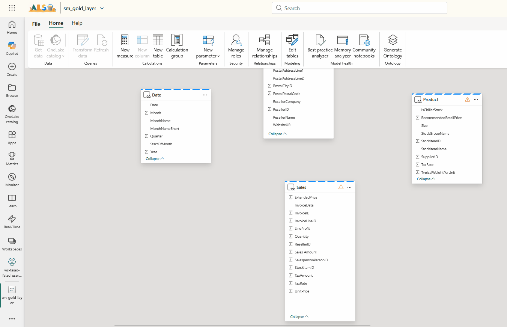
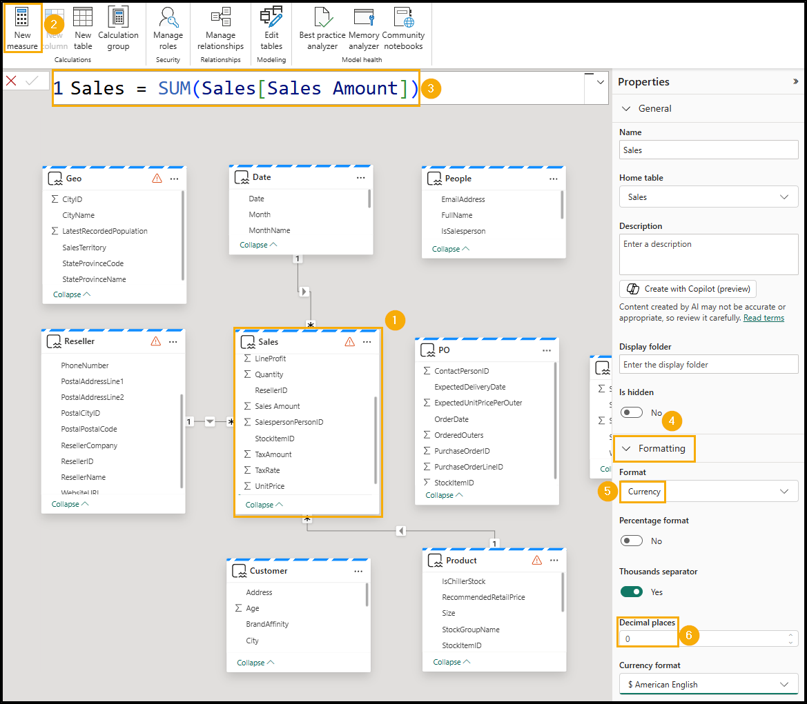
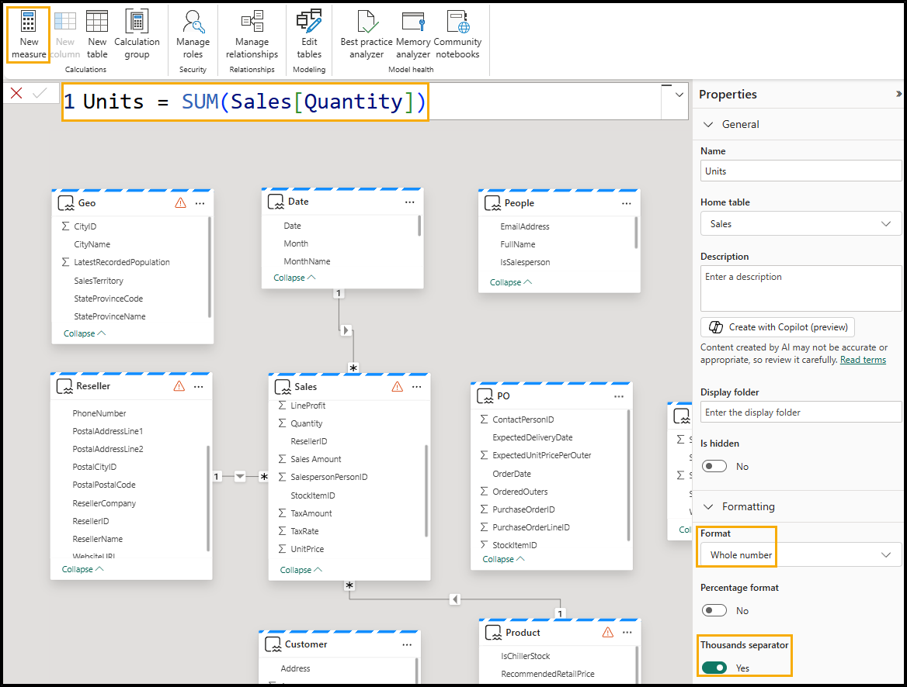
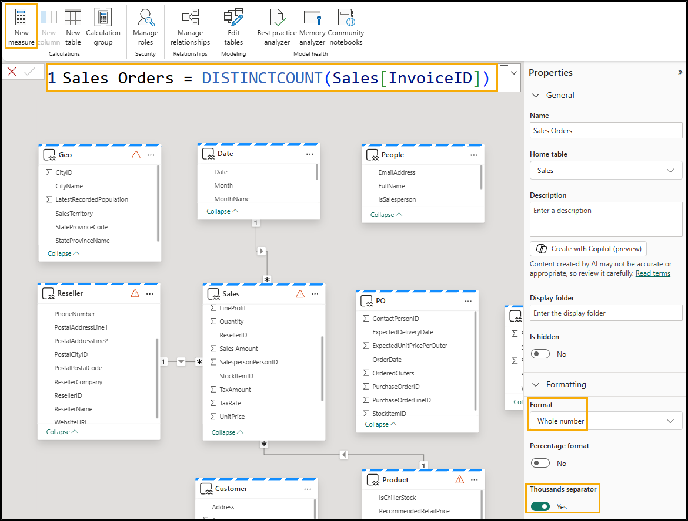

# The goal
In this lab we will create a semantic model on top of our lakehouse sql endpoint, using Direct Lake Mode.

# Activate a Power BI Pro Free Trial
In order to being able to create the semantic model we need a Power BI Pro License. To get a free trial we need to do the following steps.

1. Create a __New item__ (1) and choose __Report__ (2).

2. You should be greeted with the message that you need Power BI Pro. Choose __Try Free__ and acknowledge that your trial version started.

# Create semantic model

1. In your workspace navigate to the __SQL analytics endpoint__ of your lakehouse.

2. Click on __New semantic model__ (1) and give it a name (2). Next you need to select the following items (3):
- Tables
   - `customers`
   - `DateDim`
   - `people`
- Views (__all__)
   - `Geo`
   - `PO`
   - `Product`
   - `Reseller`
   - `Sales`
   - `Supplier`

Confirm (4) and let it create your semantic model.

# Do some housekeeping chores
First we need to rename three of our tables, so they match the rest of our naming schema.

On the right side select `customers`, press __F2__ to enter the renaming mode and rename the table to `Customer`.

Next we rename `DateDim` to `Date` and `people` to `People`.

# Create relationships and measures (part 1)
As a quick and dirty model the agent can already work with, we will only build out the following:

## Create relationships
You create relationships by simply dragging the field from the _dimension table_ onto the _fact table_. 

1. Drag `ResellerId` from the table `Reseller` onto `ResellerId` of the table `Sales`.

2. Drag `StockItemId` from the table `Product` onto `StockItemId` of the table `Sales`.

3. Drag `Date` from the table `Date` onto `InvoiceDate` of the table `Sales`.

## Create measures

1. Select __Sales table__ from the model view. We want to add the measures to the Sales table.

2. From the top menu, select __Home -> New Measure__. Notice the formula bar is displayed.

3. Enter `Sales = SUM('Sales'[Sales Amount])` in the formula bar.

4. Click the __check mark__ left of the formula bar or click the __Enter__ button.

5. Expand the Properties panel on the right.

6. Expand the __Formatting__ section.

7. From the __Format__ dropdown select __Currency__.

8. Set Decimal places to __0__.

9. With the __Sales table__ selected from the top menu, select __Home -> New Measure__. Notice the formula bar is displayed.

10. Enter `Units = SUM('Sales'[Quantity])` in the __formula bar__.

11. Click the __check mark__ left of the formula bar or click the __Enter__ button.

12. In the Properties panel on the right, expand the __Formatting__ section (it may take a few moments for the Properties panel to load).

13. From the __Format__ dropdown select __Whole number__.

14. Use the slider to set __Thousands separator__ to __Yes__.

15. With the __Sales table__ selected from the top menu, select __Home -> New Measure__. Notice the formula bar is displayed.

16. Enter Sales `Orders = DISTINCTCOUNT('Sales'[InvoiceID])` in the formula bar.

17. Click the __check mark__ left of the formula bar or click the __Enter__ button.

18. In the Properties panel on the right, expand the __Formatting__ section.

19. From the __Format__ dropdown select __Whole number__.

20. Use the slider to set __Thousands separator__ to __Yes__.
