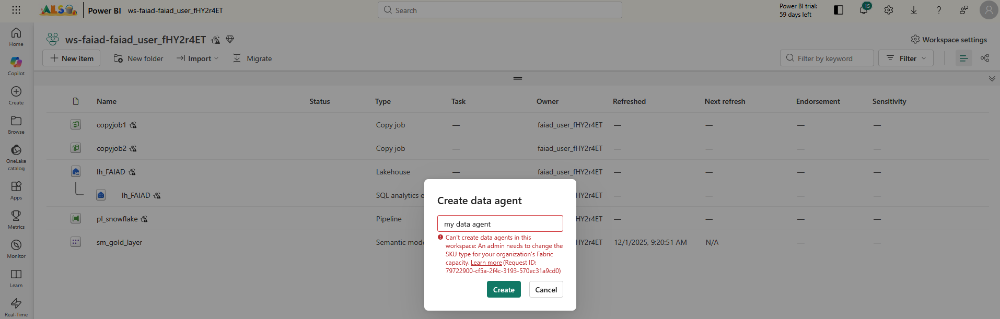
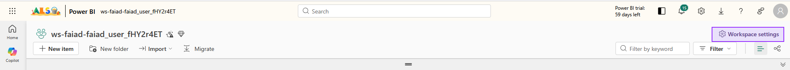
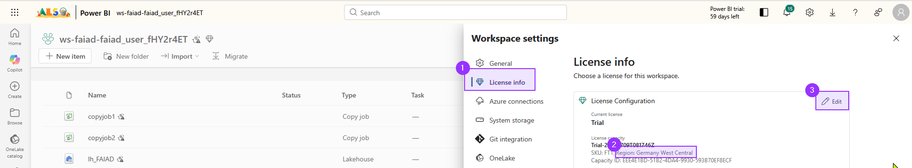
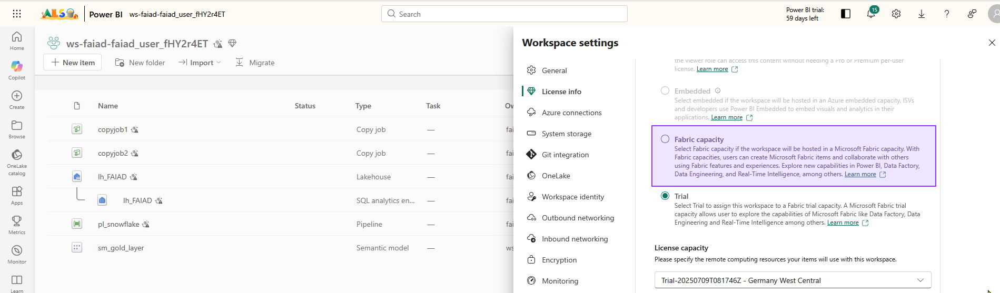
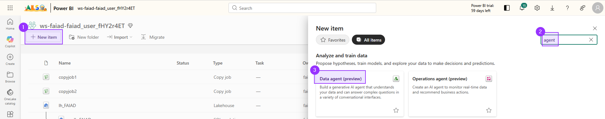
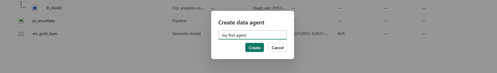
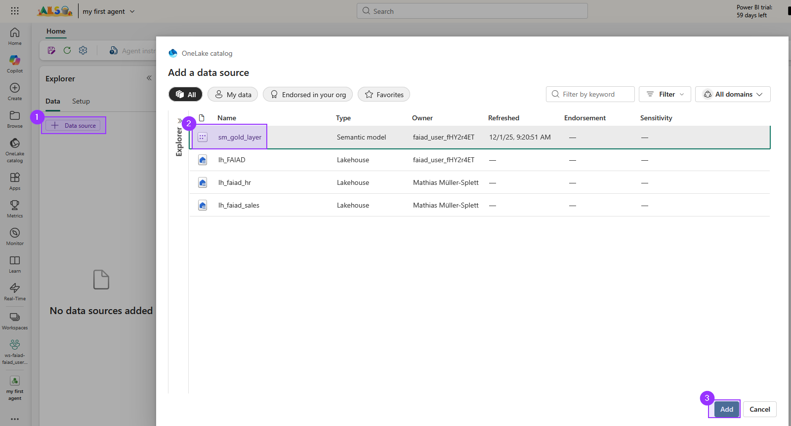
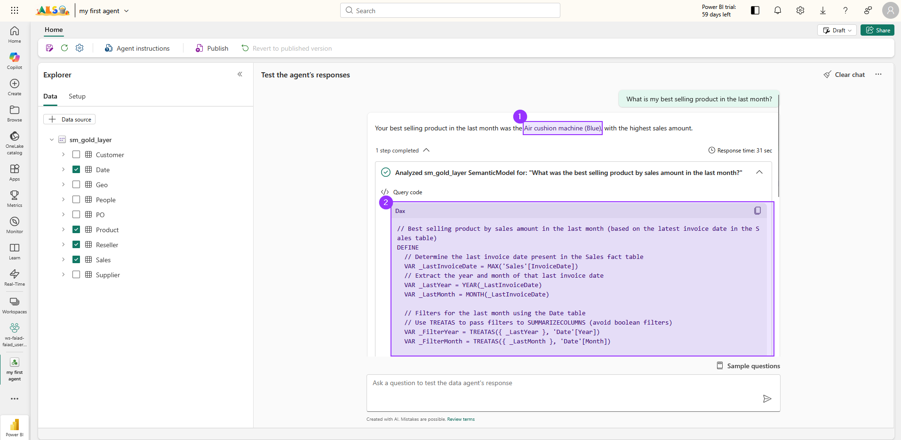

# The goal
Now we can finally play a bit with AI. In this lab we will create a data agent, thats using our gold layer semantic model.

Everything copilot and AI is not covered by the Fabric Trial. For this we need to use a __paid capacity__.


# Switch our workspace to a paid capacity
1. On the top right click on __Workspace settings__.


2. In the workspace settings click on __License info__ (1). Note that our Trial in running in __Germany West Central__ (2). We can freely change capacities, as long as they are located in the same region. Click on __Edit__ (3) to switch to a paid capacity.


3. Select __Fabric capacity__ from the options, and then you should be able to select `fabricgermanywestcentral - Germany West Central` from the dropdown menu.


4. Acknowledge with a click on __Select license__.

# Create the agent

1. Click on __New item__ and search for `Agent` (2). Afterwards select __Data agent (preview)__ from the list.


2. Give it a name and click __Create__.


3. Connect a __Data source__ (1) and select your __semantic model__ from the previous lab (2) and click __Add__ (3).


<div style="border: 1px solid #FFA500; background-color: #FFF8E1; padding: 3px; border-radius: 4px; color: #000;">
<b>Note: </b>Adding the semantic model can take a little while, so give it a minute or two.
</div>

4. Next we need to choose the content of our data source the agent should use. Since we only set up a simple semantic model, we only select the four tables:
- `Date`
- `Product`
- `Reseller`
- `Sales`


# Ask your first question
And now we can already start hammering the agent with questions.

```
What is my best selling product in the last month?
```

The answer is "Air cushion machine (blue)" (1). And the agents gives us the chance to inspect the underlying DAX query it sent to the semantic model in order to retrieve this answer (2). 


And at least in my test the DAX query looked very good. What is notable:
- as it's first step he determined until which month he has data (ends in April 2024 actually)
- it used our measure from the previous step to find the sales amount
``` DAX
# ATTENTION: AI-generated code can include errors or operations you didn't intend. Review the code in this cell carefully before running it.

// Best selling product by sales amount in the last month (based on the latest invoice date in the Sales table)
DEFINE
  // Determine the last invoice date present in the Sales fact table
  VAR _LastInvoiceDate = MAX('Sales'[InvoiceDate])
  // Extract the year and month of that last invoice date
  VAR _LastYear = YEAR(_LastInvoiceDate)
  VAR _LastMonth = MONTH(_LastInvoiceDate)

  // Filters for the last month using the Date table
  // Use TREATAS to pass filters to SUMMARIZECOLUMNS (avoid boolean filters)
  VAR _FilterYear = TREATAS({ _LastYear }, 'Date'[Year])
  VAR _FilterMonth = TREATAS({ _LastMonth }, 'Date'[Month])

  // Compute total sales amount by product for the last month
  VAR _SalesByProductLastMonth =
    SUMMARIZECOLUMNS(
      'Product'[StockItemID],
      'Product'[StockItemName],
      _FilterYear,
      _FilterMonth,
      "Sales Amount", [Sales] // Uses the [Sales] measure from the 'Sales' table
    )

  // Get the single best selling product by sales amount
  VAR _TopProductLastMonth =
    TOPN(
      1,
      _SalesByProductLastMonth,
      [Sales Amount], DESC,
      'Product'[StockItemName], ASC // Tiebreaker for deterministic ordering
    )

EVALUATE
  SELECTCOLUMNS(
    _TopProductLastMonth,
    "Product Name", 'Product'[StockItemName],
    "Sales Amount", [Sales Amount]
  )
ORDER BY
  [Sales Amount] DESC,
  [Product Name] ASC
```